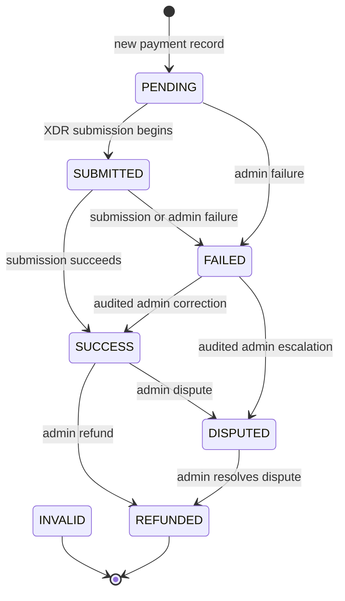
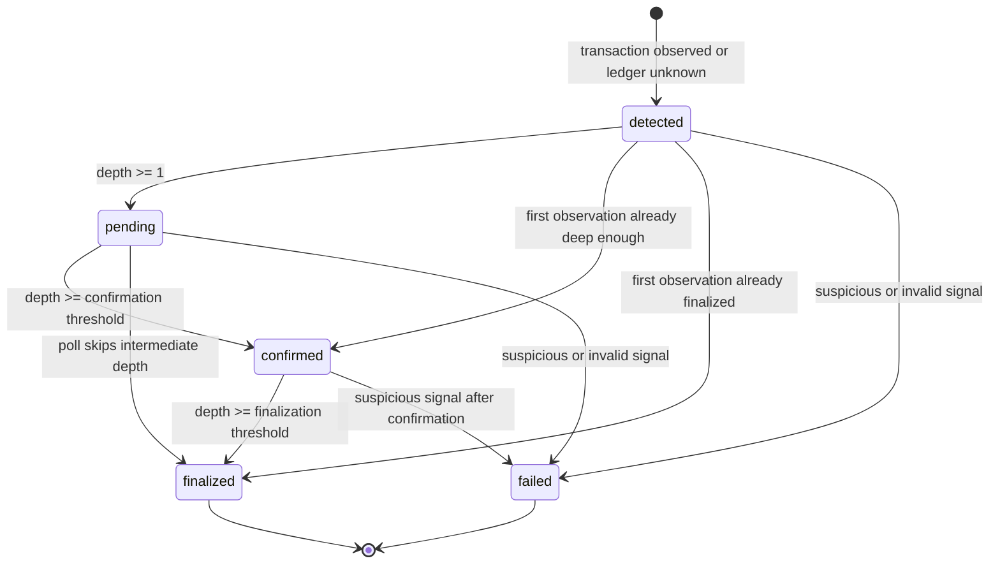

# Payment Lifecycle State Machine

This document is the integration contract for payment lifecycle states. PaymentFlow exposes two related state machines on a payment record:

1. `status` is the business and administrative status returned by payment APIs.
2. `confirmationState` is the on-chain finality state used by polling and reconciliation. `confirmationStatus` is its legacy three-value projection.

They are intentionally separate. A payment can have `status: SUCCESS` while its confirmation state is still `detected`, `pending`, `confirmed`, or `finalized`; a suspicious payment can retain `status: SUCCESS` while its confirmation state becomes `failed` and its legacy confirmation status becomes `failed`. Integrators should use the field that matches their decision.

The canonical definitions are implemented in [`backend/src/constants/paymentStatus.js`](../backend/src/constants/paymentStatus.js) and [`backend/src/services/paymentConfirmationStateMachine.js`](../backend/src/services/paymentConfirmationStateMachine.js). The transition behavior is covered by [`backend/tests/paymentConfirmationStateMachine.test.js`](../backend/tests/paymentConfirmationStateMachine.test.js), [`tests/paymentModelTransition.test.js`](../tests/paymentModelTransition.test.js), and [`tests/updatePaymentStatus.test.js`](../tests/updatePaymentStatus.test.js).

## State Diagram

### Business status

The poller and verification path may create a valid on-chain payment directly as `SUCCESS`; they do not have to persist the `PENDING -> SUBMITTED -> SUCCESS` submission path first.

### On-chain confirmation and finality

With the configured `CONFIRMATION_THRESHOLD` and `FINALIZATION_THRESHOLD`:

`detected`, `pending`, and `confirmed` are non-terminal. `finalized` and `failed` are terminal in this state machine. Re-polling is idempotent and cannot regress a state or move a terminal state.

## API-Visible Statuses

### `payment.status`

These are the canonical uppercase values in payment API responses and the `Payment` model enum.

| Status | Meaning | Typical entry | Allowed next states |
| --- | --- | --- | --- |
| `PENDING` | Payment record exists but submission or processing has not begun. | New payment record or payment intent matching. | `FAILED` by an admin path; `SUBMITTED` when an XDR submission begins. |
| `SUBMITTED` | An XDR submission or processing attempt has started. | `submitTransaction`. | `SUCCESS` after successful submission; `FAILED` after a failed submission or admin action. |
| `SUCCESS` | Payment was accepted/recorded as a valid payment. | Successful submission, verification, or Stellar sync. | `DISPUTED` or `REFUNDED` through an audited admin transition. |
| `FAILED` | Payment processing failed or a permanent failure was recorded. | Failed XDR submission, permanent verification error, or admin action. | No normal transition. An audited admin override may move it to `SUCCESS` or `DISPUTED`; it cannot move directly to `PENDING` or `REFUNDED`. |
| `DISPUTED` | Payment is under an administrative or parent dispute workflow. | Admin status update or dispute resolution workflow. | `REFUNDED` through an audited admin transition. |
| `REFUNDED` | Payment has been refunded. | Admin/refund workflow. | None. This is terminal for `payment.status`. |
| `INVALID` | Payment is structurally invalid and must not be credited. | Invalid payment handling or legacy data. | None. Treat as terminal. |

The admin status endpoint uses the wider transition table and requires a reason. Successful transitions are audited. A request for an unlisted edge returns `400 INVALID_TRANSITION`; missing status/reason returns `400 VALIDATION_ERROR`; unknown payments return `404 NOT_FOUND`.

### Confirmation fields

| Field | API values | Meaning |
| --- | --- | --- |
| `confirmationState` | `detected`, `pending`, `confirmed`, `finalized`, `failed` | Fine-grained finality state. New records default to `detected`. |
| `confirmationStatus` | `pending_confirmation`, `confirmed`, `failed` | Legacy projection: `detected`/`pending` map to `pending_confirmation`; `confirmed`/`finalized` map to `confirmed`; `failed` maps to `failed`. |

The balance, receipt, and finality paths treat `confirmed` and `finalized` as confirmed-or-above. A suspicious signal can force `confirmationState: failed` from any non-terminal confirmation state, including `confirmed`; it does not automatically rewrite the separate business `status` field.

### Related payment API statuses

These fields are returned by payment-related endpoints but are not transitions of `payment.status`.

| Field | Values | Lifecycle meaning |
| --- | --- | --- |
| Payment intent `status` | `pending`, `completed`, `expired` | `pending` is usable for submission; `completed` is matched to a recorded payment; `expired` is bookkeeping and does not block crediting when a valid transaction arrives. |
| `feeValidationStatus` | `valid`, `underpaid`, `overpaid`, `partial`, `unknown` | Financial classification of the payment or cumulative student payments, not a payment lifecycle state. |
| `underpaidReconciliation.status` | `pending`, `partial_credited`, `refund_initiated`, `refund_completed` | Nested workflow for an underpaid payment. It does not replace `payment.status` or `confirmationState`. |

## Transition Rules

### Canonical business status table

The normal table is used by model saves without an admin override. The admin table is used by the authenticated admin status endpoint and by audited workflows that set `$locals.adminOverride = true`.

| From | Normal path | Admin path | Notes |
| --- | --- | --- | --- |
| `PENDING` | `FAILED` | `FAILED` | There is no reset to `PENDING`. |
| `SUBMITTED` | `FAILED` | `FAILED` | Stuck submissions are re-queued without changing status. |
| `SUCCESS` | `DISPUTED`, `REFUNDED` | `DISPUTED`, `REFUNDED` | Success is not terminal in the backend business state machine. |
| `FAILED` | none | `SUCCESS`, `DISPUTED` | Corrections require explicit audit context. No direct refund or reset. |
| `DISPUTED` | none | `REFUNDED` | Resolution through refund is admin-only. |
| `REFUNDED` | none | none | Terminal. |
| `INVALID` | none | none | Terminal; no recovery edge is defined. |

A same-status save is a no-op. Any edge absent from the applicable table is invalid, even if the target value is a valid status. The model pre-save hook is the persistence backstop, so bypassing the controller does not make an unlisted edge valid.

### Confirmation state table

| From | Allowed next states | Rule |
| --- | --- | --- |
| `detected` | `pending`, `confirmed`, `finalized`, `failed` | First observation may skip ahead when ledger depth is already sufficient. |
| `pending` | `confirmed`, `finalized`, `failed` | A poll may skip `confirmed` if it observes finality directly. |
| `confirmed` | `finalized`, `failed` | A suspicious signal can invalidate a previously confirmed observation. |
| `finalized` | none | Terminal and never regresses. |
| `failed` | none | Terminal and never re-enters confirmation. |

The resolver rejects unknown target states, treats a missing current state as `detected`, and returns an unchanged result for same-state or lower-ranked targets. The only exception to the rank rule is the `failed` escape from a non-terminal state.

## Retry Behavior

Retries operate on processing jobs and do not create extra payment records or loosen status-transition rules.

1. **Transient verification failure:** `verifyPayment` returns `202` with `status: queued_for_retry` and persists a retry job. The payment may not yet exist, or an existing payment remains unchanged.
2. **Durability first:** a `PendingVerification` record is written to MongoDB before the Redis/BullMQ enqueue. If Redis is unavailable, MongoDB recovery re-queues `pending` or `processing` jobs later.
3. **Backoff:** the BullMQ retry queue uses exponential backoff with configured maximum attempts, delay, multiplier, and jitter. The MongoDB fallback uses the same transient/permanent error classification contract.
4. **Permanent failure:** errors such as failed on-chain transactions, missing memo, invalid destination/asset, duplicate transaction, invalid hash, and transaction-not-found are not retried. The job is marked dead or moved to the dead-letter queue, and verification may persist a `FAILED` payment record.
5. **Interrupted work:** graceful-shutdown interruption resets the processing job to `pending`; it is not a payment failure and is eligible for startup recovery.
6. **Stuck submitted payments:** payments remaining `SUBMITTED` longer than the reconciliation threshold are re-queued. Re-queuing does not change their business status.
7. **Idempotency:** duplicate transaction hashes are rejected as `DUPLICATE_TX` and handled as an already-processed result. Retries must not double-credit a student or create a second payment.

Retrying a job is not the same as changing `FAILED` to `SUCCESS`. Only an authenticated, audited admin correction can make that business-status transition.

## Reconciliation Guidance

- Use `payment.status` for business workflow, disputes, refunds, and administrative actions.
- Use `confirmationState` for on-chain depth and finality. Re-poll until `confirmed` for balance/receipt decisions and until `finalized` when practical irreversibility is required.
- Use `confirmationStatus` only when integrating with legacy consumers; do not infer `finalized` from it because both `confirmed` and `finalized` map to `confirmed`.
- Treat `finalized`, `REFUNDED`, and `INVALID` as terminal in their respective state machines. Do not write an ad hoc reset transition.
- A `FAILED` business status requires manual investigation. An admin may correct it only to `SUCCESS` or `DISPUTED`, with an audit reason. A confirmation-state `failed` value is terminal and cannot be manually advanced by the confirmation resolver.
- For suspected missing or delayed payments, inspect the transaction hash, `PendingVerification` job state, retry/dead-letter state, `confirmationState`, and reconciliation logs before creating a manual record.
- For underpaid payments, follow the separate credit/refund workflow. Do not use `payment.status` or `confirmationState` to represent partial credit progress.

## Implementation References

- Canonical business statuses and transitions: [`backend/src/constants/paymentStatus.js`](../backend/src/constants/paymentStatus.js)
- Confirmation state machine: [`backend/src/services/paymentConfirmationStateMachine.js`](../backend/src/services/paymentConfirmationStateMachine.js)
- Payment model validation: [`backend/src/models/paymentModel.js`](../backend/src/models/paymentModel.js)
- Verification and sync paths: [`backend/src/controllers/paymentController.js`](../backend/src/controllers/paymentController.js) and [`backend/src/services/stellarService.js`](../backend/src/services/stellarService.js)
- Retry classification: [`backend/src/services/retryContract.js`](../backend/src/services/retryContract.js)
- Stuck-payment reconciliation: [`backend/src/services/stuckPaymentReconciliation.js`](../backend/src/services/stuckPaymentReconciliation.js)
- Confirmation state tests: [`backend/tests/paymentConfirmationStateMachine.test.js`](../backend/tests/paymentConfirmationStateMachine.test.js)
- Business transition tests: [`tests/paymentModelTransition.test.js`](../tests/paymentModelTransition.test.js), [`tests/updatePaymentStatus.test.js`](../tests/updatePaymentStatus.test.js), and [`backend/tests/issue1029-failedStatusRecovery.test.js`](../backend/tests/issue1029-failedStatusRecovery.test.js)
